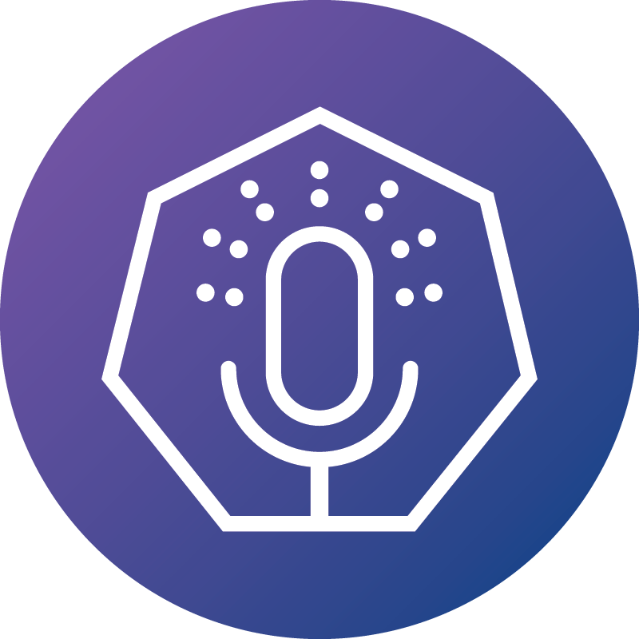

 

#The Podlets

Exploring Cloud Native, one buzzword at a time!

## Ways to suggest an episode

- Add an issue to this repository (much preferred!)
- Contact us on Twitter: [@thepodlets](https://twitter.com/thepodlets)
- Email us at: info@thepodlets.io.

## About the podcast

The Podlets is a weekly podcast show that takes a “concept first” approach at exploring the Cloud Native space. It is a show that approaches Cloud Native concerns with the intention of explaining what the concepts are, what they do, why they are needed, and how it all ties in to concepts of computer science and distributed systems.

Newcomers to the space as well as aspirants will appreciate the reasoning, explanations, and real world examples. Advanced users will benefit from having a source that helps them keep up with the ever evolving Cloud Native field by breaking down Cloud Native concepts and explaining them in recognizable terms. Because the Cloud Native space moves so quickly, there is no such thing as an “expert” of every aspect of the ecosystem, and there’s lots of new terminology being introduced by developers. We will provide a well-rounded exploration of Cloud Native elements, patterns, use-cases, and real world experience in production environments.

Finally, Cloud native technologies have elements unique to the space. In the greater tech community, there is not only a lack of knowledge of concepts and specific technologies, but also misunderstanding and almost mysticism surrounding the space. The Podlets show aims to elucidate and demystify these elements and help people confidently embrace cloud native.

This podcast is a work of passion from VMware engineers who want to share their experiences and hopefully help people along their own Cloud Native journey. We have a team of 7 hosts on rotation, each with distinct experiences and outlooks, as well as a variety of knowledge from production use cases.

Episodes are being released both as YouTube videos on the VMware Cloud Native channel as well as a podcast show in the usual podcast distribution channels. Since our goal is to get you well-rounded and excited about Cloud Native, episodes will post every Monday, as you get ready for your week. To watch or listen to the show, head on over to https://thepodlets.io, or follow us on Twitter [@thepodlets](https://twitter.com/thepodlets). You may also contact us at info@thepodlets.io.
